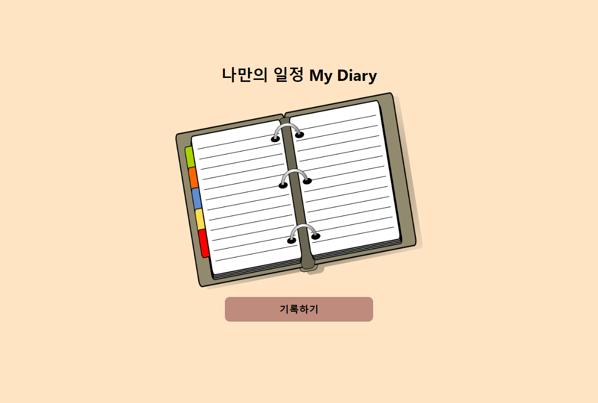
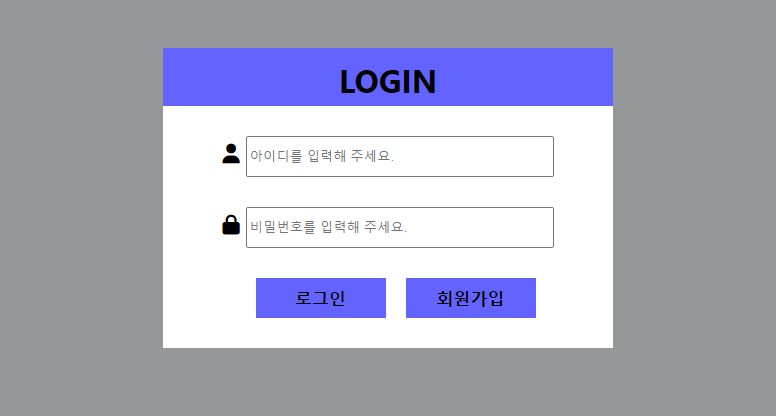
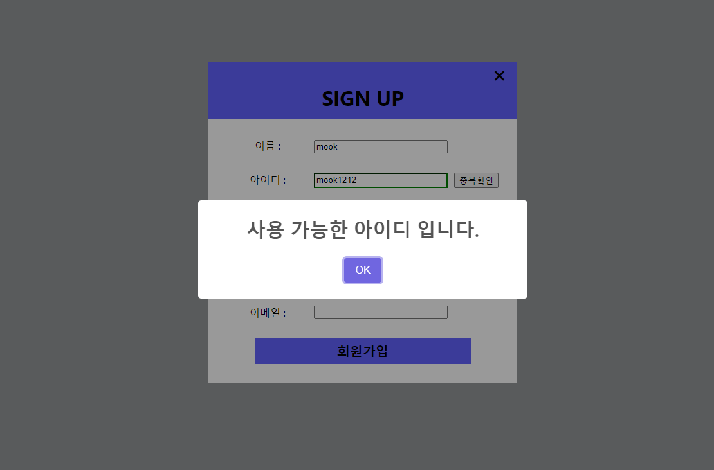
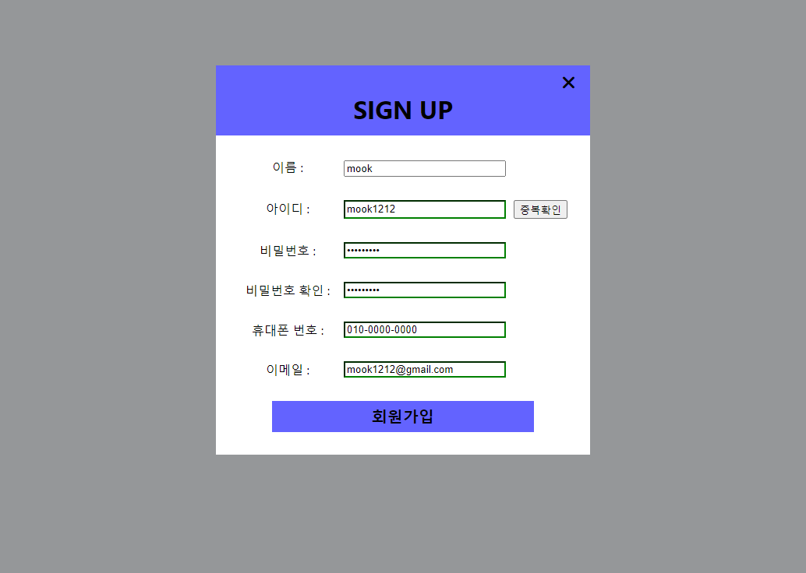
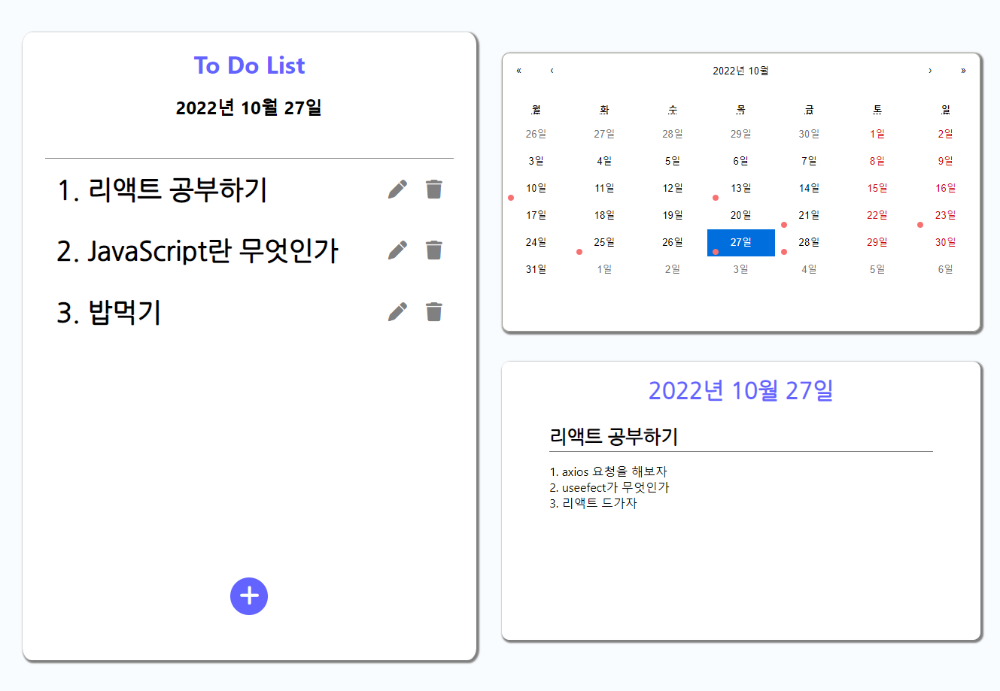
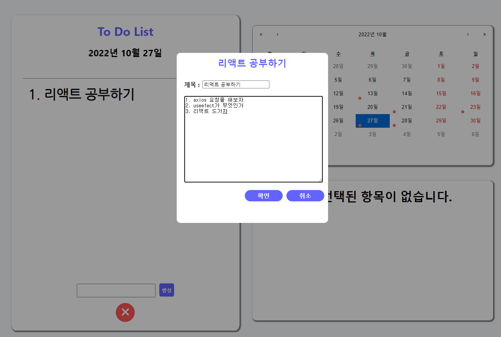

# 나만의 일정 My Diary (React)
<!--  -->

# 📌 Summary

복잡하고 바쁜 일상속에서 나만의 일정을 정리해서 한 눈에 볼 수 있는 나만의 Diary입니다.

React를 기반으로 node express mongoDB를 이용하여 CRUD가 가능하도록 개발하였습니다.
  

## * 주요기능

* 로그인
* 정규식을 이용한 회원가입

<figure>
    
    
    
</figure>

node express로 DB와 연동하여 구현한 로그인 회원가입 기능입니다.

정규식을 이용하여 회원가입폼을 구현하였고 DB에 있는 회원 데이터를 가져와 아이디 중복확인이 가능합니다. 

Localstorage를 이용하여 로그인 회원을 확인하고 현재 로그인한 회원의 DB를 따로 가져와 개개인 마다 일정을 작성 할 수 있습니다.

  
  

* 날짜별 일정
* 일정 추가,삭제,수정

<figure>
    
    
</figure>

React Caleder 라이브러리를 이용하여 달력을 만들어 날짜별 일정을 상세히 작성 할 수 있도록 개발하였습니다.

일정이 작성된 날은 달력에 체크가 되어 내가 무슨 요일에 일정이 있는지 한 눈에 알아 볼 수 있습니다. 

일정 추가,수정,삭제가 가능하며 내가 생성한 항목을 클릭시 그 항목에 관한 상세 내용을 볼 수 있습니다.

  

# 🔨 Technology Stack

* Front-End : React, HTML, CSS , JS
* Back-End : node.js, express , mongoDB
